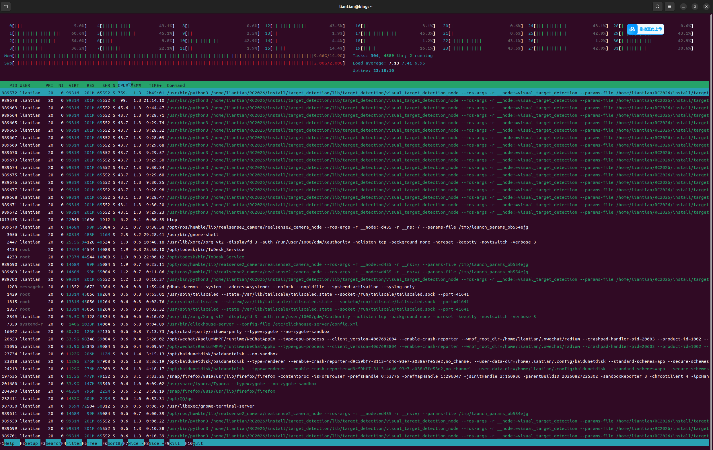
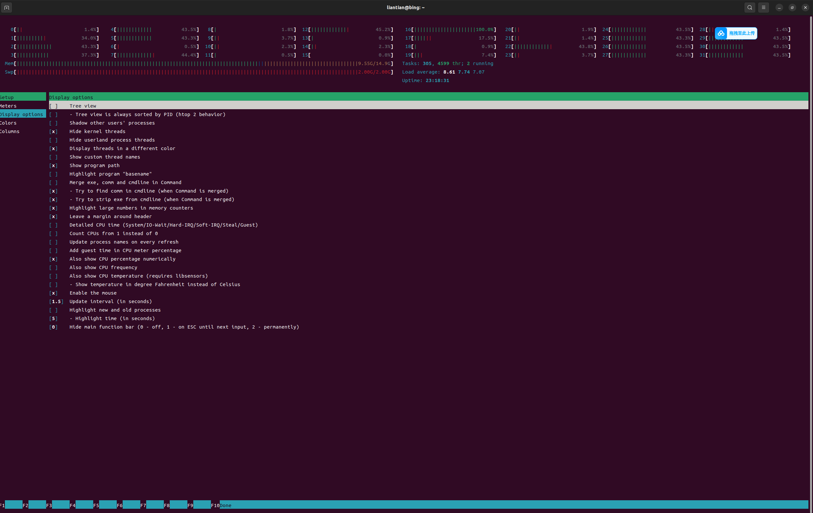
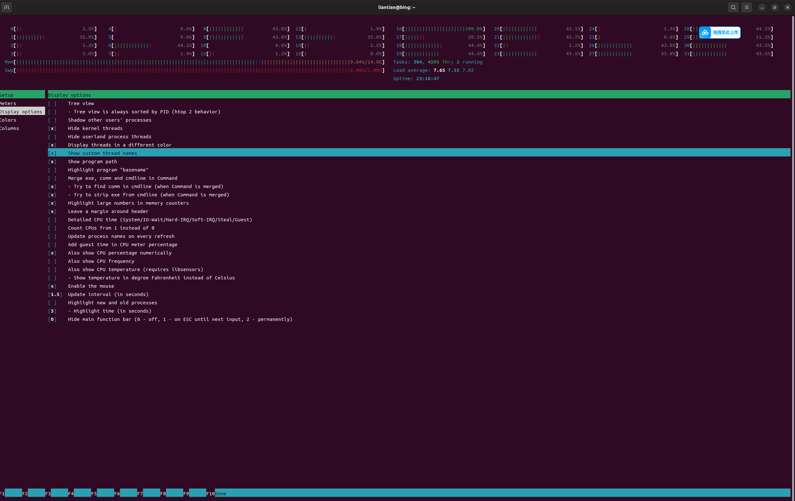
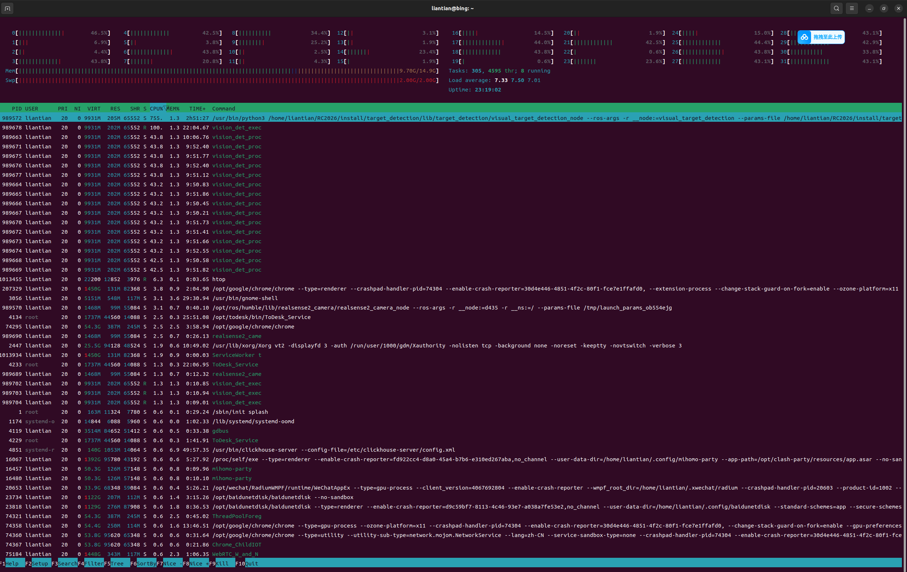

写代码时候的准备:指定进程和线程的名称:

在同文件夹下面有元件,括号里面的是GPT给我的答案,这个有些误导我了,其实线程和进程都是由底层的posix程序来创造的,实际上我们使用的rclpy或者是rclcpp都只是posix的执行者,他的内部是直接去调用了posix来创造的线程和进程,一般使用htop来查进程线程,显示的还是文件路径加上一堆的子线程主要是,你没有开线程客户端的name显示(这也是为什么你以后给 AI 下这种工程任务时，最好说：

> ### **“你在写代码的过程中要给进程和线程命名,我一般是使用ros2的humble版本,你给线程和进程命名的时候不要只实现功能，同时要考虑线程可观测性，并验证线程名能否在 Linux/Perfetto 中实际显示,我会使用htop来看具体的那个进程那个线程使用了多少资源。”**

尤其是你现在关注的 **PID / TID / Node 名称 / Thread Name / Perfetto**，我建议你以后给 AI 的要求写成：

> #### **ROS 2 Humble + Ubuntu/Linux 环境。涉及多线程时，明确区分 ROS 2 Node 名称、Linux 进程名、Linux 线程名和 TID。凡是程序自己创建的线程，都设置有业务含义的线程名称；凡是 ROS 2 Executor 内部创建的线程，要使用 Humble 实际支持的方式进行命名，并验证线程名是否能在 Linux/Perfetto 中看到。不要假设 ROS 2 Node 名称就是线程名或进程名。**

这样 AI 在给你写代码时，就会按照 **Humble 的实际机制**来考虑，而不是拿新版本 ROS 2 的 API 硬套。

加指定进程名**“我使用 ROS 2 Humble + Ubuntu，请分别设置 ROS 2 Node 名称、Linux Process Name 和 Thread Name，并确保三者不要混淆；对于进程名和线程名，请使用 Humble/Linux 实际支持的机制。”**)

下面教怎么改成显示指定的name

这个是刚进来的时候的显示

我的电脑上面,不知道为什么按F10,不会直接保存并且退出,我之后按ctlr+c也还是原来的模样,其实直接按esc取消键就行

一些工具比如说:
htop,atop,btop

这里主要讲的是htop
